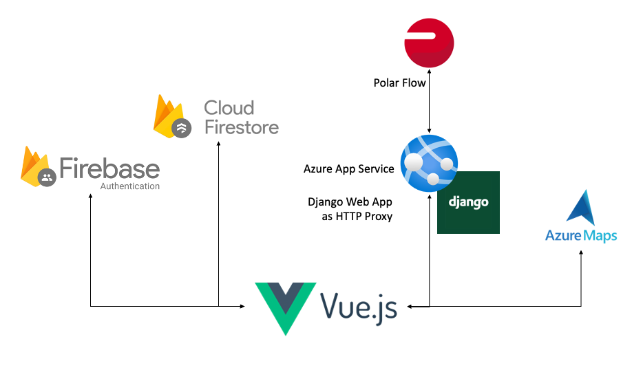

# DHBW Mannheim - Web Programming

This repository contains the code for the project of the course Web Programming at the DHBW Mannheim. The aim was to
build an interactive Webapp in Vue.js and use Firebase as a BaaS Provider.

## Contributors
- Friedemann Baumgärtel
- Lukas Stamm
- [Tjark Gerken](mailto:tjarkgerken@icloud.com)

## Tech-Stack
- [Vue.js](https://vuejs.org/)
- [Firebase](https://firebase.google.com/)
- [Tailwind CSS](https://tailwindcss.com/)

## Project Description 🇬🇧 
Peak Pulse is an activity tracker and activity viewer for the manufacturer Polar. It enables the user to
to connect to their Polar Flow account and use the Polar Flow API to display new activities created in the Polar Flow
app or with a Polar watch in a clear form in a dashboard. In addition, weekly statistics are displayed and it is possible to set goals in the areas of time, distance
time, distance and calories burned, which are compared with the transferred activities and evaluated.  Users also 
have a profile page where they can view and edit their data.

### Infrastructure
The following infrastructure was used to implement the project described.
As specified, the Vue.js framework was used as the frontend and linked to the backend as a service provider Firebase
was linked. The data is stored in a Firestore database and authentication is handled via the
Firebase Authentication API. The Polar Flow API is used to retrieve the user's activities.
Since the Polar Flow API does not set CORS headers, the data cannot be loaded directly into the browser. Therefore
an additional Django backend was set up, which serves as a proxy for the HTTP requests to the Polar Flow API
and sets the CORS headers so that the data can be loaded in the browser. The Django backend is only used as an HTTP
proxy as the task specifies the use of Firebase and Vue.js. 
To enrich the data from the Polar Flow API, the Azure Maps Service is used to obtain further information about the user's location.
the location of the user.



Authentication with the Polar Flow API is explained in the following. The user is authenticated via the OAuth2
application and receives a code that is automatically used by Vue to link the user to the app and to obtain an 
access code. This access code is used for further authentication.
Activities are retrieved by calling the Polar Flow API with the access code and a transaction is created. If new 
data is available since the last request, the references to the activities are returned with the transaction.
These references are then used to retrieve the activities and store them in Firestore so that they can be stored 
persistently. The transaction is then committed to communicate to the Polar Flow API that the data has been 
successfully retrieved 
and stored.
Further information can be found in the [Polar Flow API documentation](https://www.polar.com/accesslink-api/#polar-accesslink-api)


### Implementation of the CRUD functions:

- **C**reate: Create new goals and activities
- **R**ead: View goals and activities and profiles
- **U**pdate: Edit profile
- **D**elete: Delete goals and activities


## Project Beschreibung 🇩🇪

Peak Pulse ist ein Aktivitätstracker und ein Viewer für Aktivitäten des Herstellers Polar. Es ermöglicht dem Nutzer 
sich mit seinem Polar Flow Account zu verbinden und über die Polar Flow API neue Aktivitäten, die in der Polar Flow 
App oder mit einer Polar Uhr erstellt werden in einer übersichtlichen Form in einem Dashboard darzustellen. Darüber 
hinaus werden wöchentliche Statistiken dargestellt und es besteht die Möglichkeit sich Ziele zu setzen in den 
Bereichen Zeit, Distanz und verbrannten Kalorien die mit den übertragenen Aktivitäten abgeglichen werden und 
ausgewertet werden. Zusätzlich hat der Nutzer eine Profilseite auf der er seine Daten einsehen und bearbeiten kann.

### Infrastruktur
Um das beschriebene Projekt umzusetzen wurde die folgende Infrastruktur verwendet. 
Als Frontend wurde wie vorgegeben das Framework Vue.js verwendet und mit dem Backend as a Service Anbieter Firebase 
verknüpft. Die Daten werden in einer Firestore Datenbank gespeichert und die Authentifizierung wird über die 
Firebase Authentication API abgewickelt. Die Polar Flow API wird verwendet, um die Aktivitäten des Nutzers abzurufen.
Da die Polar Flow API keine CORS Header setzt können die Daten nicht direkt in den Browser geladen werden. Daher 
wurde zusätzlich ein Django Backend aufgesetzt, welches als Proxy für die HTTP Anfragen an die Polar Flow API dient 
und die CORS Header setzt, damit die Daten im Browser geladen werden können. Das Django Backend ist nur als HTTP 
Proxy eingesetzt da die Aufgabenstellung die Verwendung von Firebase und Vue.js vorgibt.
Um die Daten aus der Polar Flow API anzureichern wird der Azure Maps Service genutzt um weitere Informationen über 
den Standort des Nutzers zu erhalten.


Die Authentifizierung mit der Polar Flow API ist im folgenden dargestellt. Der Nutzer wird über die OAuth2 
Application bei Polar authentifiziert und erhält einen Code, der von der Vue genutzt wird, um den Nutzer mit der App 
zu verknüpfen und einen Access Code zu erhalten. Über diesen Access Code folgt die weitere Authentifizierung. 
Aktivitäten werden abgerufen indem, die Polar Flow API mit dem Access Code aufgerufen wird und eine Transaktion 
erstellt wird. Wenn neue Daten seit der letzten Anfrage vorhanden sind, werden die Referenzen zu den Aktivitäten mit 
der Transaktion zurückgegeben. Diese Referenzen werden dann genutzt, um die Aktivitäten abzurufen und in Firestore zu 
speichern, damit sie im persistent gespeichert werden können. Danach wir die Transaktion committed und der Polar Flow 
API damit kommuniziert, dass die Daten erfolgreich abgerufen und gespeichert wurden. 
Weitere Informationen sind in der [Polar Flow API Dokumentation](https://www.polar.com/accesslink-api/#polar-accesslink-api) zu finden


### Implementierung der CRUD Funktionen:

- **C**reate: Erstellen von neuen Goals und Aktivitäten
- **R**ead: Anzeigen von Goals und Aktivitäten und Profile
- **U**pdate: Bearbeiten vom Profil
- **D**elete: Löschen von Goals und Aktivitäten

## Project Setup for Development

```sh
npm install
```

### Compile and Hot-Reload for Development

```sh
npm run dev
```

### Compile and Minify for Production

```sh
npm run build
```

# Run Prod Version locally via Docker
The project can be run from a docker container. The docker image is hosted on docker hub and can be pulled from there.
The docker image is based on nginx but needs the input of the environment variables to run. The environment 
variables can be foud in the .env.example file. 
## Build Docker Image:

```sh
 docker build . -t webprogramming
```

## Pull Docker Image:

```sh
docker pull tjarkger/web-programming101
```

## Run via Docker:

```sh
docker run -d -p 8080:80 tjarkger/web-programming101 #add env variables for the website to run
```

Open page on: http://localhost:8080/
